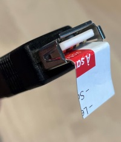
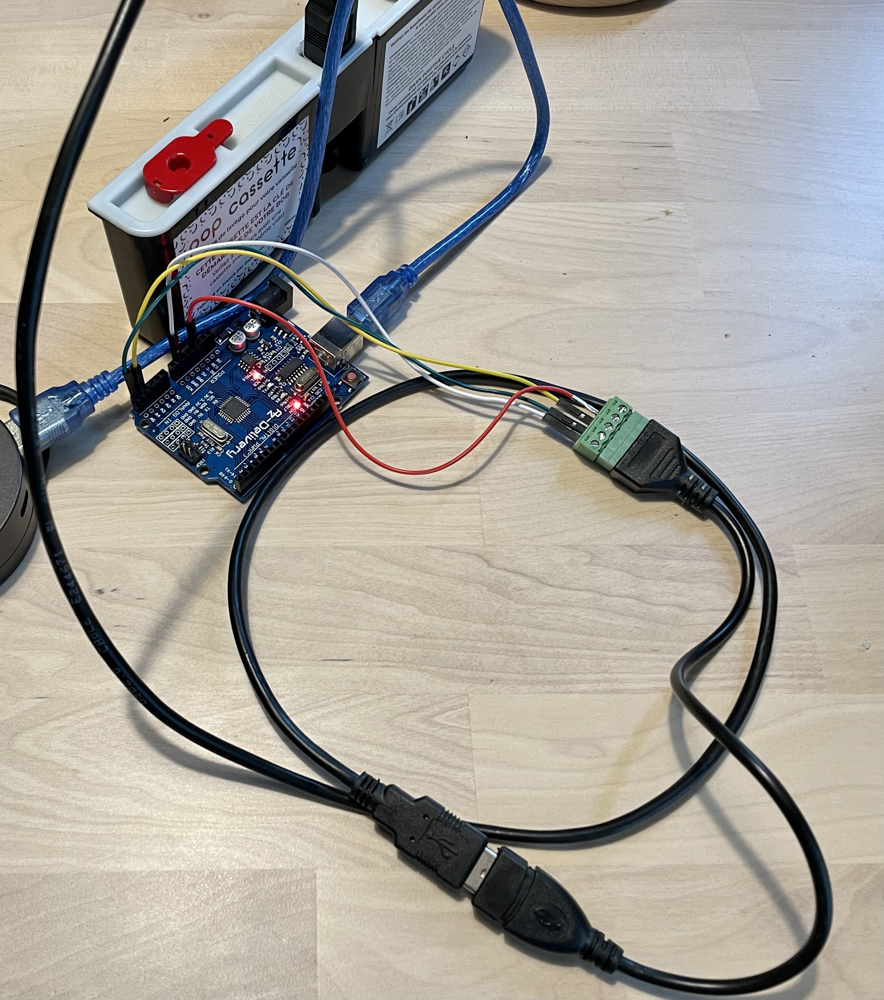

Arduino program to reset a Bob cassette (Pop / Rock)

**Based on https://github.com/dekuNukem/bob_cassette_rewinder (a must read !)**

## Source

Arduino sketch (source) is in sub directory *reset-bob-cassette*.

## Wiring:
 
| Arduino  | USB A | Color  |
|----------|-------|--------|
| A4 (SDA) | D-    | yellow |
| A5 (SCL) | D+    | green  |
| 3.3V     | +     | red    |
| Gnd      | -     | white  |

Cassette connector: Isolate/cover (with a piece of paper) connector side opposite to cassette labels and connect USB A female to connector on cassette side with labels.

## Blinking status

- Alternate 0.5 sec: no cassette found / cassette not recognized.
- Continuous 10 sec: cassette found - reset successful or nothing to do.
- Alternate 100ms for 5 sec: cassette found - failed to reset cassette.

## Resources

- https://github.com/dekuNukem/bob_cassette_rewinder
- https://learn.sparkfun.com/tutorials/reading-and-writing-serial-eeproms/all
- https://create.arduino.cc/projecthub/gatoninja236/how-to-use-i2c-eeprom-30767d
- https://gammon.com.au/i2c